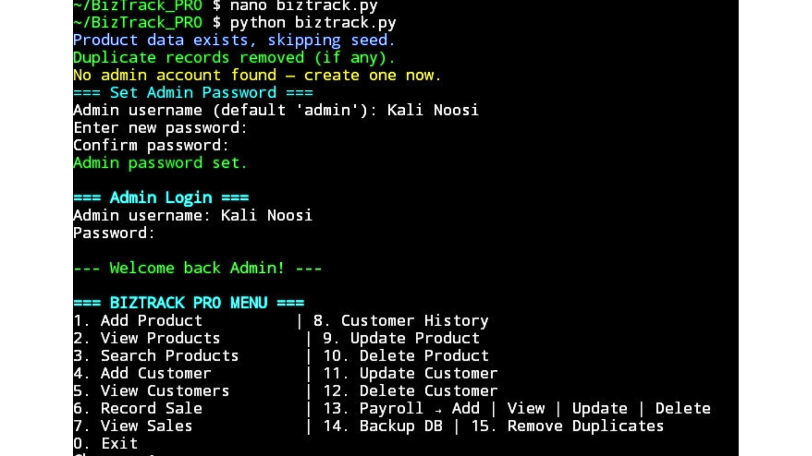
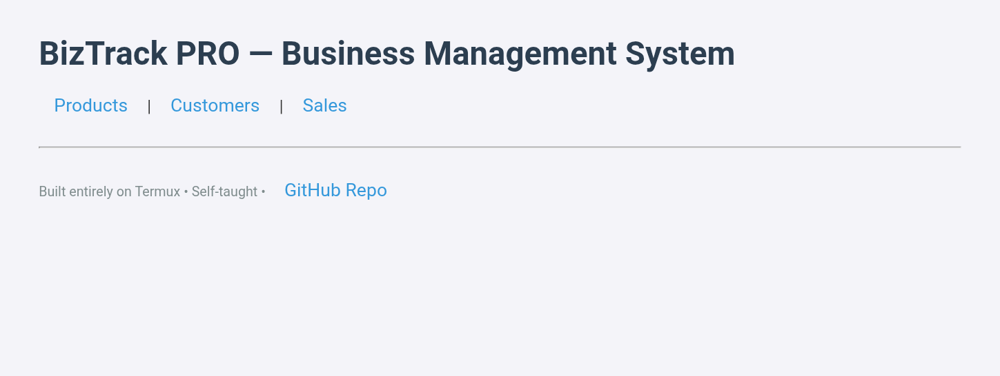
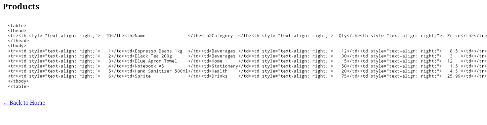
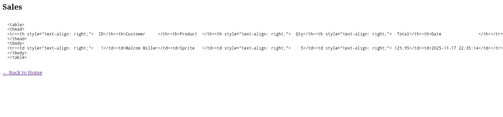
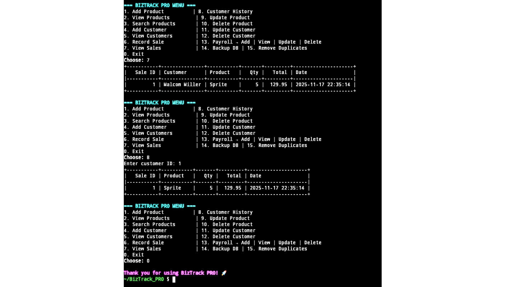

# BizTrack PRO — Full Business Management System in One Python File

**Built from scratch in under 3 months — entirely on Termux (Android phone)**  
Self-taught • Zero prior experience • No laptop • 100% passing tests

### Features
- Products • Customers • Sales • Payroll (full CRUD)
- Secure admin login (PBKDF2)
- CLI + Flask web dashboard + Tkinter GUI
- CSV import/export • Text receipts • Auto backups
- Low-stock alerts • Duplicate cleanup
- In-memory pytest suite

### Tech Stack
- Pure Python 3
- SQLite (zero setup)
- Flask • Tkinter • colorama • tabulate

### Quick Start (SSH recommended)
```bash
git clone git@github.com:kalinoosi681-droid/BizTrack_PRO.git
cd BizTrack_PRO
bash install.sh

python biztrack.py          # CLI mode
python biztrack.py --web    # Web dashboard → http://127.0.0.1:5000
python biztrack.py --gui    # Desktop GUI
```
**Screenshots

CLI menu


Web dashboard


Products and Sales



Receipt



##Why This Project Exists

11 weeks ago I wrote my first line of Python.Today I shipped a full ERP system on my phone.
                            No excuses. Just code. 

Open for contributions • Paid customization gigs available [https://www.fiverr.com/s/zWgWDjo]/[https://www.upwork.com/freelancers/~0111dc3602d28046c4?mp_source=share]

Made with love in Lesotho

MIT License 
